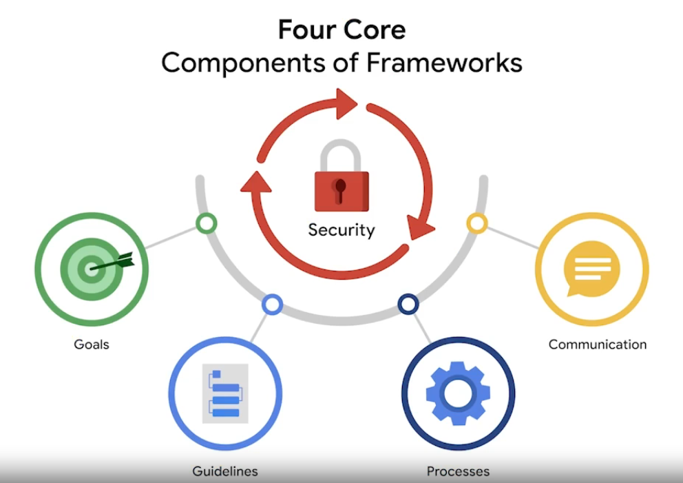

<h1 style="text-align: center;text-decoration:underline;">Introduction to Security frameworks and controls</h1>

## Security frameworks
Guidelines used for building plans to help mitigate risk and threats to data and privacy. Security frameworks provide a structured approach to implementing a security lifecycle. The security lifecycle is a constantly evolving set of policies and standards that define how an organization manages risks, follows established guidelines, and meets regulatory compliance, or laws.

## Purpose of Security Frameworks
The purpose of security frameworks includes:
*   protecting personally identifiable information (PII)
*   securing financial information
*   identifying security weaknesses
*   managing organizational risks
*   aligning security with business goals

## Core Components of Frameworks 

*   identifying and documenting security goals
        - compliance with regulations.
*   setting guidelines to achieve security goals
        - to develop new policies for how to handle data requests from individual users.
*   implementing strong security processes
        - help design procedures to ensure the organization complies with verified user data requests, an example of this type of request is when a user attempts to update or delete their profile information.
*   monitoring and communicating results
        - a security analyst monitors organization's internal network and reports a potential security issue affecting regulatory compliance to the manager or regulatory compliance officer.

## Security controls
Safeguards designed to reduce specific security risks. An organization may have a guideline that requires all the employees to complete a privacy training to reduce the risk of data breaches. A security analyst, may use a software tool to automatically assign and track which employees have completed this training.

## CIA Triad
CIA triad is a foundational model that helps inform how organizations consider risk when setting up systems and security policies. CIA stands for confidentiality, integrity, and availability.
*   Confidentiality - only authorized users can access specific assets or data. For example, strict access controls that define who should and should not have access to data, must be put in place to ensure confidential data remains safe.
*   Integrity - the data is correct, authentic, and reliable. For example, to maintain integrity, security professionals can use a form of data protection like encryption to safeguard data from being tampered with.
*   Availability - the data is accessible to those who are authorized to access it.

## Asset
An asset is an item perceived as having value to an organization. Value is determined by the cost associated with the asset in question.

An application that stores sensitive data such as social security numbers or bank accounts, is a valuable asset to an organization. It carries more risk and therefore requires tighter security controls in comparison to a website that shares publicly available news content.

## NIST Cybersecurity Famework (CSF)

NIST Cybersecurity Framework is a voluntary framework that consists of standards, guidelines, and best practices to manage cybersecurity risk. Security teams use CSF as
a baseline to manage short and long-term risk. Managing and mitigating risks and protecting an organization's assets from threat actors are key goals for security professionals. Understanding the different motives a threat actor may have, alongside identifying your organization's most valuable assets is important.

Consider a scenario: a disgruntled employee has recently left the organization. A security analyst is expected to reduce this type of risk, using the principle of availability, as well as organizational guidelines based on frameworks to ensure staff members can only access the data they need to perform their jobs.

There are a number of regulations that are frequently revised. It is necessary to stay up-to-date with changes and explore more frameworks, controls, and compliance.
Suggestions to research: the Gramm-Leach-Bliley Act and the Sarbanes-Oxley Act.